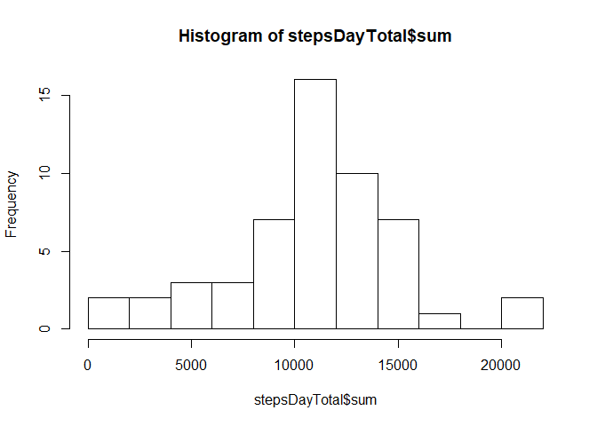
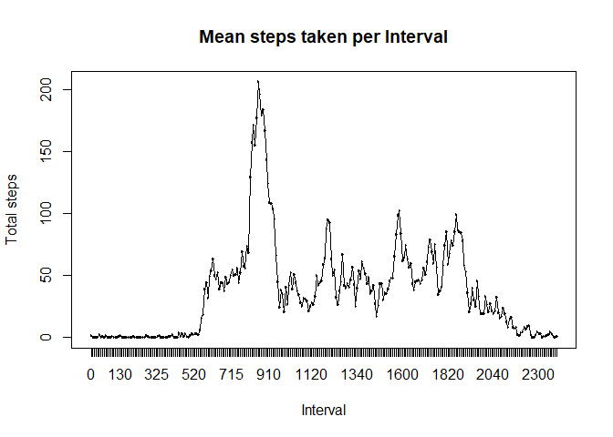
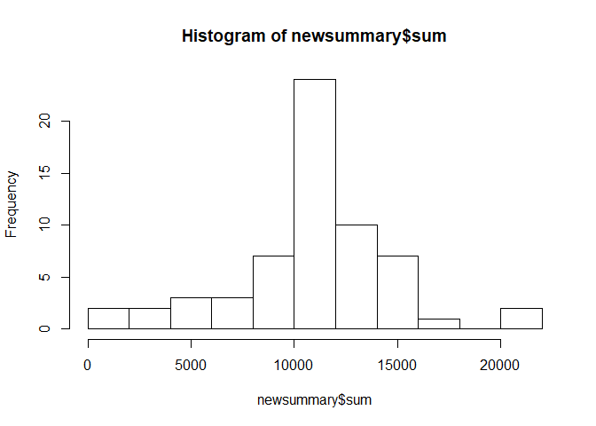
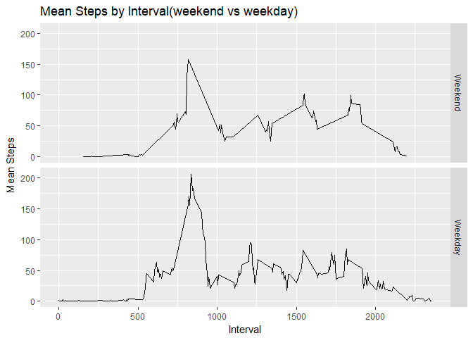

## Loading and preprocessing the data


```r
library(chron)
library(ggplot2)
library(dplyr)
options(dplyr.print_max = 100)
dataset <- read.csv(unz("activity.zip","activity.csv"))
```

## What is mean total number of steps taken per day?
A histogram to represent the distribuition of steps taken each day. 

below the graph we calculate the mean and medain os the average steps taken each day.


```r
#Make a subset of dataset whicch is grouped by date and has a sum of steps taken for each day.
	stepsDayTotal <- group_by(dataset, date) %>% summarise( sum = sum(steps))


hist(stepsDayTotal$sum, breaks = 10, main = "Mean Steps per Day", xlab = "Steps taken per Day")
```

<!-- -->

```r
#Mean of steps taken per day
	mean(stepsDayTotal$sum, na.rm = TRUE)
```

```
## [1] 10766.19
```

```r
#Median of steps taken per day
	median(stepsDayTotal$sum, na.rm = TRUE)
```

```
## [1] 10765
```


## What is the average daily activity pattern?

The average daily activity pattern is represented by the graph below.

```r
stepsByinterval <- group_by(dataset, as.factor(interval)) %>% summarise(sum(steps, na.rm = TRUE), mean = mean(steps, na.rm = TRUE))
names(stepsByinterval) <- c("interval","sum","mean")

plot(stepsByinterval$mean ~ stepsByinterval$interval, main = "Mean steps taken per Interval", xlab = "Interval", ylab = "Total steps")

lines(stepsByinterval$mean ~ stepsByinterval$interval, type = "l")
```

<!-- -->

```r
#Finds the interval with the largest number of steps and records it as greatSteps
	greatSteps <- stepsByinterval[which.max(stepsByinterval$sum),c(1:2)]
	names(greatSteps) <- c("Interval","Total")
	print(greatSteps)
```

```
## # A tibble: 1 x 2
##   Interval Total
##     <fctr> <int>
## 1      835 10927
```


## Imputing missing values

The total amount of missing values is calculated by counting all the NA values and then taking the sum.

Then the NA values are replaced with the mean of the matching interval.


```r
# Calcualte the total number of rows with an NA value
sum(is.na(dataset$steps))
```

```
## [1] 2304
```

```r
mrg <- merge(dataset, stepsByinterval, by.x = "interval", by.y = "interval")
	
	for (i in seq_along(mrg$steps)){
  		if (is.na(mrg$steps[i]) == TRUE){mrg$steps[i] <- mrg$mean[i]}
	}

newsummary <- group_by(mrg, date) %>% summarise( sum = sum(steps))
hist(newsummary$sum, breaks = 10, main = "Total Steps taken per Day", xlab = "Total steps per Day")
```

<!-- -->

```r
#Calculate new mean after NA's have been filled in
	mean(newsummary$sum, na.rm = TRUE)
```

```
## [1] 10766.19
```

```r
#Calculate new median after NA's have been filled in
	median(newsummary$sum, na.rm = TRUE)
```

```
## [1] 10766.19
```
The methods of filling in the NA's has caused the mean and median to be the same value. Filling the NA's with the mean value has put a large number of the mean value in the dataset, this caused the median value to be one of these imputed means.

## Are there differences in activity patterns between weekdays and weekends?

The activity patterns for weekends and weekdays have many similarities, but are no identical.  They can be seen in the chart below.


```r
#Foramt Column into a date format, create new variable column that is a factor of date being a weekend of weekday.
	dataset$date <- as.Date(dataset$date, "%Y-%m-%d")
	mrg$isWeekDay <- as.factor(as.numeric(!is.weekend(dataset$date)))
	levels(mrg$isWeekDay) <- c("Weekend", "Weekday")

qplot(interval, mean, data = mrg, facets = isWeekDay~. , geom = "line", main = "Mean Steps by Interval(weekend vs weekday)", xlab = "Interval", ylab = "Mean Steps")
```

<!-- -->
