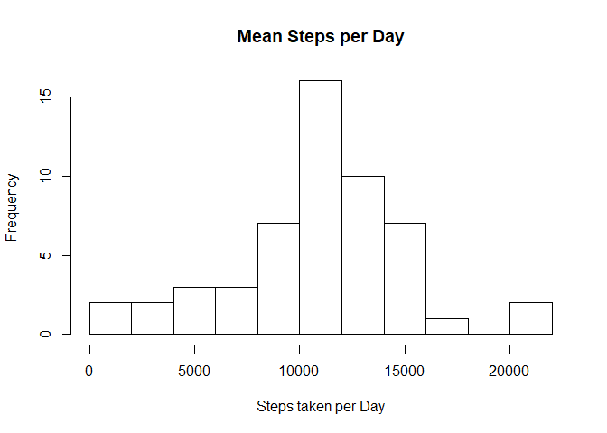
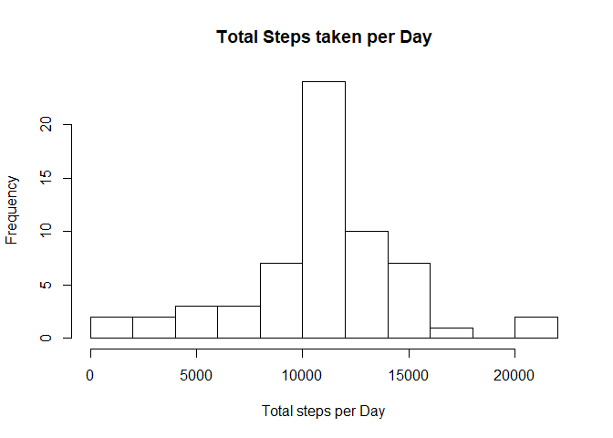

## Loading and preprocessing the data


```r
library(dplyr)
options(dplyr.print_max = 100)
dataset <- read.csv(unz("activity.zip","activity.csv"))
#dataset$date <- as.Date(dataset$date, "%Y%m%d")
```

## What is mean total number of steps taken per day?

```r
stepsDayTotal <- group_by(dataset, date) %>% summarise( sum = sum(steps))

hist(stepsDayTotal$sum, breaks = 10)
```

<!-- -->

```r
mean(stepsDayTotal$sum, na.rm = TRUE)
```

```
## [1] 10766.19
```

```r
median(stepsDayTotal$sum, na.rm = TRUE)
```

```
## [1] 10765
```


## What is the average daily activity pattern?


```r
stepsByinterval <- group_by(dataset, as.factor(interval)) %>% summarise(sum(steps, na.rm = TRUE), mean = mean(steps, na.rm = TRUE))
names(stepsByinterval) <- c("interval","sum","mean")

plot(stepsByinterval$sum ~ stepsByinterval$interval)
lines(stepsByinterval$sum ~ stepsByinterval$interval, type = "l")
```

<!-- -->

```r
stepsByinterval[which.max(stepsByinterval$sum),]
```

```
## # A tibble: 1 x 3
##   interval   sum     mean
##     <fctr> <int>    <dbl>
## 1      835 10927 206.1698
```


## Imputing missing values
A sum is made of all missing values then dataset and stepsByinterval tables are merged. This is for the purpose of replacing all the NA in the steps collum with the interval mean.


```r
sum(is.na(dataset$steps))
```

```
## [1] 2304
```

```r
mrg <- merge(dataset, stepsByinterval, by.x = "interval", by.y = "interval")

for (i in seq_along(mrg$steps)){
  if (is.na(mrg$steps[i]) == TRUE){mrg$steps[i] <- mrg$mean[i]}
}

newsummary <- group_by(mrg, date) %>% summarise( sum = sum(steps))

hist(newsummary$sum, breaks = 10)
```

<!-- -->

```r
mean(newsummary$sum, na.rm = TRUE)
```

```
## [1] 10766.19
```

```r
median(newsummary$sum, na.rm = TRUE)
```

```
## [1] 10766.19
```
The methods of filling in the NA's has caused the mean and median to be the same value.

## Are there differences in activity patterns between weekdays and weekends?

